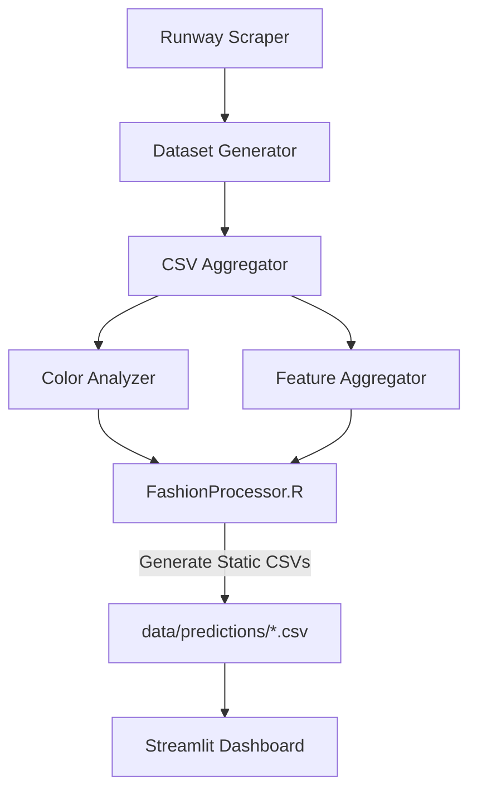

# Fashion Trend Analysis and Prediction System

## Pipeline Overview



## Component Details

### 1. Data Collection & Processing
- **Runway Scraper**: Collects fashion show images and metadata
- **Dataset Generator**: Processes raw data into structured format
- **CSV Aggregator**: Combines and standardizes data from multiple sources

### 2. Analysis Pipeline
- **Color Analyzer**: Extracts and analyzes color trends from images
- **Feature Aggregator**: Processes style, pattern, and category features
- **FashionProcessor.R**: 
  - Performs trend analysis
  - Generates predictions
  - Handles color trend integration
  - Outputs prediction files to data/predictions/

### 3. Visualization (Cloud-Ready)
- **Streamlit Dashboard**: Interactive visualization of trends and predictions
  - Reads from static CSV files in data/predictions/
  - No dynamic processing required
  - Cloud-deployment ready
  - Required files:
    - color_predictions.csv
    - style_predictions.csv
    - category_predictions.csv
    - pattern_predictions.csv
    - super_category_predictions.csv

## Directory Structure
```
project/
├── data/
│   └── predictions/        # Static CSV files for dashboard
│       ├── color_predictions.csv
│       ├── style_predictions.csv
│       ├── category_predictions.csv
│       ├── pattern_predictions.csv
│       └── super_category_predictions.csv
├── pages/
│   ├── Home.py            # Streamlit dashboard home
│   ├── 1_Whats_Trending_Now.py
│   └── 2_LSTM_Test.py
└── requirements.txt       # Python dependencies
```

## Deployment Options

### 1. Local Development
```bash
# Install dependencies
pip install -r requirements.txt

# Run dashboard locally
streamlit run Home.py
```

### 2. Cloud Deployment
The Streamlit dashboard is designed for cloud deployment (Streamlit Cloud, Heroku, etc.):
- Only requires static CSV files in data/predictions/
- No background processing needed
- No R dependencies required for dashboard
- Minimal Python dependencies

#### Required Files for Cloud:
1. All .py files in root and pages/
2. requirements.txt
3. data/predictions/*.csv files
4. No need to include data processing scripts or R files

## Data Processing Pipeline (Optional)
Only needed if generating new predictions:

```bash
# Install full dependencies
Rscript setup_r_env.R
pip install -r requirements.txt

# Run data processing
python src/runway_scraper.py
python src/dataset_generator.py
python src/csv_aggregator.py

# Run analysis
python src/color_analyzer.py
python src/feature_aggregator.py
Rscript models/fashion_processor.R
```

## Dashboard Dependencies
Minimal requirements for running the dashboard:
```
streamlit==1.31.0
pandas==2.0.3
plotly==5.18.0
```

## Notes
- Dashboard reads from static CSV files - no dynamic processing required
- Prediction CSVs must be present in data/predictions/
- Cloud deployment only needs dashboard-related files
- Full pipeline setup only needed for generating new predictions

## Contributing
Please ensure all data processing scripts maintain the expected output format for compatibility with the R analysis pipeline.
