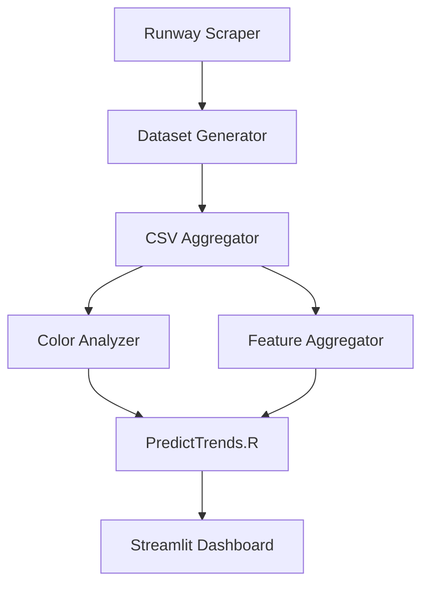

# Fashion Trend Analysis and Prediction System

## Pipeline Overview



## Component Details

### 1. Data Collection & Processing
- **Runway Scraper**: Collects fashion show images and metadata
- **Dataset Generator**: Processes raw data into structured format
- **CSV Aggregator**: Combines and standardizes data from multiple sources

### 2. Analysis Pipeline
- **Color Analyzer**: Extracts and analyzes color trends from images
- **Feature Aggregator**: Processes style, pattern, and category features
- **FashionProcessor.R**: 
  - Performs trend analysis
  - Generates predictions
  - Handles color trend integration
  - Outputs prediction files for visualization

### 3. Visualization
- **Streamlit Dashboard**: Interactive visualization of trends and predictions
  - Color trends
  - Style predictions
  - Category analysis
  - Pattern forecasting

## Directory Structure
```
project/
├── data/
│   ├── raw/                # Raw scraped data
│   ├── processed/          # Processed datasets
│   ├── predictions/        # Model predictions
│   └── examples/          # Example images
├── models/
│   ├── predict_trends.R    # Trend prediction models
│   └── fashion_ml_forecasting.R
├── pages/
│   ├── Home.py            # Streamlit dashboard home
│   ├── 1_Whats_Trending_Now.py
│   └── 2_LSTM_Test.py
└── setup_r_env.R          # Environment setup
```

## Setup and Usage

1. **Environment Setup**
```bash
# Install R dependencies
Rscript setup_r_env.R

# Install Python dependencies
pip install -r requirements.txt
```

2. **Run Pipeline**
```bash
# Run data processing
python src/runway_scraper.py
python src/dataset_generator.py
python src/csv_aggregator.py

# Run analysis
python src/color_analyzer.py
python src/feature_aggregator.py
Rscript models/fashion_processor.R

# Start dashboard
streamlit run Home.py
```

## Dependencies

### R Packages
- tidyverse
- tensorflow
- keras
- reticulate

### Python Packages
- streamlit
- pandas
- plotly
- numpy
- PIL

## Notes
- Color analyzer integration is experimental
- Ensure all data processing steps complete before running FashionProcessor.R
- Dashboard requires processed prediction files in data/predictions/

## Contributing
Please ensure all data processing scripts maintain the expected output format for compatibility with the R analysis pipeline.
